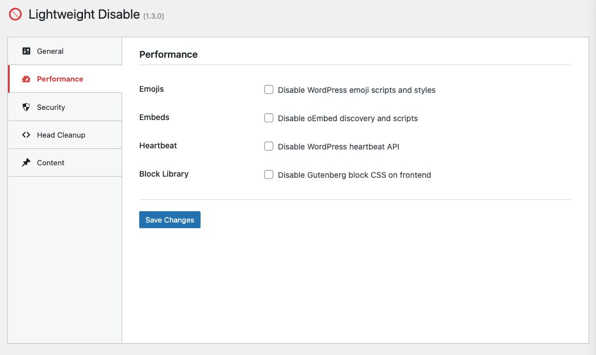

# Lightweight Disable

Disable WordPress features: comments, emojis, embeds, and more.

[](https://packagist.org/packages/lwplugins/lw-disable)
[](https://php.net)
[](https://wordpress.org)
[](https://www.gnu.org/licenses/gpl-2.0.html)



## Features

### General

- **Disable Comments** - Remove comments completely from your site

### Performance

- **Disable Emojis** - Remove WordPress emoji scripts and styles
- **Disable Embeds** - Remove oEmbed discovery and scripts
- **Disable Heartbeat** - Remove WordPress heartbeat API
- **Disable Block Library** - Remove Gutenberg CSS on frontend

### Security

- **Disable XML-RPC** - Disable XML-RPC protocol
- **Restrict REST API** - Limit REST API to logged-in users only
- **Disable App Passwords** - Remove application passwords feature
- **Remove Generator** - Hide WordPress version meta tag

### Head Cleanup

- **Remove Shortlink** - Remove shortlink from head
- **Remove RSD Link** - Remove Really Simple Discovery link
- **Remove WLW Manifest** - Remove Windows Live Writer link
- **Remove Version Strings** - Strip ?ver= from asset URLs
- **Remove Adjacent Posts** - Remove prev/next post links

### Content

- **Disable RSS Feeds** - Disable all RSS feeds completely

## Installation

```bash
composer require lwplugins/lw-disable
```

Or download and upload to `/wp-content/plugins/`.

## Usage

### Admin UI

1. Go to **LW Plugins → Disable**
2. Check the features you want to disable
3. Save

### WP-CLI

```bash
# List all features and their status
wp lw-disable list

# Enable a feature
wp lw-disable enable emojis
wp lw-disable enable comments
wp lw-disable enable xmlrpc

# Disable a feature
wp lw-disable disable emojis
wp lw-disable disable heartbeat

# Enable all features at once
wp lw-disable enable-all

# Disable all features (restore WP defaults)
wp lw-disable disable-all
```

**Available features:**

| Feature | Description |
|---------|-------------|
| `comments` | Comments system |
| `emojis` | Emoji scripts/styles |
| `embeds` | oEmbed system |
| `heartbeat` | Heartbeat API |
| `block_library` | Gutenberg CSS |
| `xmlrpc` | XML-RPC protocol |
| `rest_api` | REST API restriction |
| `application_passwords` | App passwords |
| `generator` | Version meta tag |
| `shortlink` | Shortlink header |
| `rsd_link` | RSD link |
| `wlw_manifest` | WLW manifest |
| `version_strings` | Asset version strings |
| `adjacent_posts` | Adjacent post links |
| `feeds` | RSS feeds |

## Links

- [GitHub](https://github.com/lwplugins/lw-disable)
- [Packagist](https://packagist.org/packages/lwplugins/lw-disable)
- [LW Plugins](https://lwplugins.com)


## Sponsor

<a href="https://sinann.io/">
  
</a>

Supported by [Sinann](https://sinann.io/)
